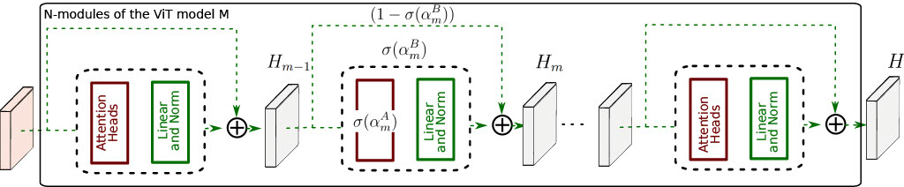

# DARIO: Differentiable vision transformer pruning with low-cost proxies

<p align="center">
    
</p>

This the official PyTorch implementation of DARIO.

## Setup

Note: everything related to zero-cost proxies is implemented in the `zero-cost-nas` folder.
To install it locally, execute the following command:
```bash
cd zero-cost-nas && pip install -e .
```
We also rely on HuggingFace `transformers` for the baseline implementation of pretrained models.
`transformers` and other dependencies can be installed using the following command:
```bash
pip install -r requirements
```

The full list of Meta-Album dataset names is available in `full_list_MetaAlbum_datasets.txt`.

`test_push_model_to_hub.py` is for testing the upload connection with HuggingFace Hub, try run `python test_push_model_to_hub.py` on a remote server before running long experiments that will upload to HuggingFace Hub in the end (to avoid wasting time).

An NVIDIA GPU is required.

## Running the pruning process

To prune a pre-trained MAE-ViT-base model with the block granularity (recommended), run the following command:
```bash
python main_search.py --lr 5e-2 --wd 1e-3 --model MAE_ViT_base
```

Similarly, to prune a pre-trained MobileViT-small model with the block granularity (recommended), run the following command:
```bash
python main_search.py --lr 5e-5 --wd 0 --model MobileViT_small
```

This command will create `.pt` file in the genotypes folder containing the discovered pruning recipe (i.e, the number of blocks to keep).

## Fine-Tuning

To fine-tune a pruned model *M* on a dataset *D* for 300 epochs, run the following command:
```bash
python main_train.py --dataset [D] --model [M] ----pruning_idx_path [path to your .pt file]
```

Note that *D* can be either `Icdar_Micro` or any of the 40 datasets of Meta-Album (see `full_list_MetaAlbum_datasets.txt`).


## Citation

TODO

